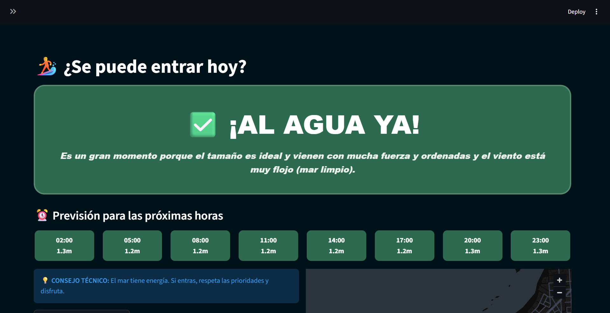

# 🏄 Surf Decision Gran Canaria (v11.0)

[](https://surf-dashboard-gc.streamlit.app/)


**El asistente inteligente para surfistas en Gran Canaria.**

Este proyecto no es solo un dashboard meteorológico; es un **Sistema de Apoyo a la Decisión (DSS)** que traduce datos oceanográficos complejos en veredictos humanos simples: **"¡Al agua ya!"** o **"Mejor quédate en casa"**.



---

## 🚀 ¿Qué hace este proyecto?

Desarrollado por un estudiante de **Ciencia e Ingeniería de Datos de la ULPGC**, este dashboard resuelve el problema de la fragmentación de información para los surfistas locales.

*   **Veredicto Humano Dinámico:** Algoritmo heurístico que analiza altura de ola, periodo y viento para generar un consejo en lenguaje natural.
*   **Semáforo de Horas:** Visualización rápida de la "Ventana de Oro" (mejor momento para surfear en las próximas 24h).
*   **Validación con Webcam:** Integración directa con webcams en vivo para confirmación visual antes de salir de casa.
*   **Análisis Multivariante:** Cruce de datos en tiempo real de las APIs de Open-Meteo (Marine & Forecast).
*   **Geolocalización:** Mapas técnicos de los spots principales: La Cícer, El Confital, La Laja y San Andrés.

## 🛠️ Stack Tecnológico

*   **Lenguaje:** Python 3.13
*   **Framework:** Streamlit
*   **Procesamiento:** Pandas & NumPy
*   **Visualización:** Plotly Express & PyDeck (Mapas 3D)
*   **Base de Datos:** SQLite3 (Persistencia de consultas e históricos)

## 📥 Instalación

Si quieres ejecutarlo en local:

1. **Clonar el repo:**
   ```bash
   git clone https://github.com/yonillo/Surf-Dashboard-gc.git
   cd Surf-Dashboard-gc
   ```

2. **Instalar librerías:**
   ```bash
   pip install -r requirements.txt
   ```

3. **Ejecutar:**
   ```bash
   python -m streamlit run app.py
   ```

---

## 📧 Contacto
**Yone Suarez** - [yonillo43@gmail.com](mailto:yonillo43@gmail.com)  
Estudiante de Ciencia e Ingeniería de Datos | **ULPGC**  
Repo: [github.com/yonillo/Surf-Dashboard-gc](https://github.com/yonillo/Surf-Dashboard-gc)
